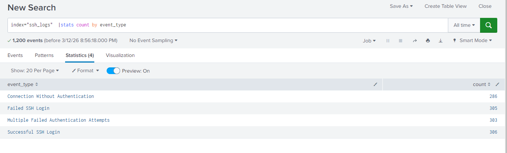
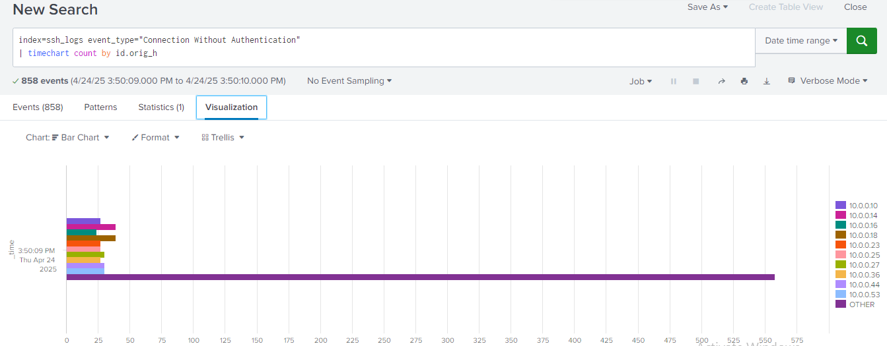

# SSH Log Analysis & Brute Force Detection using Splunk

## Overview

This project demonstrates how Security Operations Center (SOC) analysts investigate SSH authentication logs using Splunk to detect brute-force attacks, suspicious login attempts, and unauthorized access activity.

The analysis simulates common SOC monitoring activities such as detecting repeated login failures, identifying attacker IP addresses, and visualizing attack trends over time using Splunk Search Processing Language (SPL).

---

## Tools Used

* Splunk Enterprise
* Linux SSH Authentication Logs
* SPL (Search Processing Language)

---

## Dataset

The dataset used in this project is available in the **data** folder of this repository.

File used:

data/ssh_log.json

The dataset contains SSH authentication events including:

* Failed SSH login attempts
* Successful SSH login events
* Authentication attempts
* Source and destination host information

These logs simulate real-world SSH monitoring scenarios in a SOC environment.

---

## Log Ingestion

The SSH authentication logs were uploaded into Splunk for security analysis.

### Steps to Upload Logs into Splunk

1. Login to the Splunk Web Interface.
2. Navigate to **Settings → Add Data**.
3. Select **Upload** as the data input method.
4. Upload the dataset file:

ssh_log.json

5. Set the **Source Type** to:

_json

6. Create or select the index:

ssh_logs

7. Review the data preview and complete the ingestion process.

After ingestion, the logs become searchable using **Splunk Search Processing Language (SPL)**.

---

## Log Fields Analyzed

The following fields were extracted and used during the investigation:

* **event_type** – Type of SSH activity (successful login, failed login, etc.)
* **auth_success** – Indicates whether authentication succeeded
* **auth_attempts** – Number of authentication attempts
* **id.orig_h** – Source IP address initiating the connection
* **id.resp_h** – Destination host receiving the SSH connection

These fields help SOC analysts identify suspicious authentication patterns and investigate potential attacks.

---

## SOC Detection & Investigation Use Cases

The following security monitoring and investigation use cases were implemented using Splunk SPL queries:

* Log ingestion validation to verify SSH logs are successfully indexed and parsed.
* Failed SSH login detection to identify unauthorized authentication attempts.
* Top attacking IP detection to highlight the most active sources generating failed login attempts.
* Multiple failed authentication detection to identify potential brute-force attack patterns.
* Brute force detection using threshold-based analysis of repeated failed login attempts.
* Successful SSH login monitoring to analyze legitimate authentication activity.
* Detection of successful logins after repeated failures to identify possible credential compromise.
* Detection of SSH connections without authentication to identify scanning and reconnaissance activity.
* SSH connection trend monitoring over time to visualize attack patterns and persistent probing behavior.

---

## Investigation Screenshots

### Log Ingestion Validation

Splunk query used to verify that SSH logs were successfully ingested and categorized by event type.



---

### Failed SSH Login Analysis

Statistics view showing the number of failed SSH login attempts grouped by source IP address.


---

### Failed SSH Login Visualization

Column chart visualization used to identify IP addresses generating the highest number of failed authentication attempts.


---

### SSH Attack Trend Over Time

Time-based visualization showing the trend of SSH authentication attempts over time. This helps SOC analysts detect spikes in attack activity and identify persistent brute-force or scanning behavior.



---

## Project Structure

```
splunk-ssh-log-analysis/
│
├── README.md
├── queries.md
│
├── data/
│   └── ssh_log.json
│
└── screenshots/
    ├── log_ingestion_validation.png
    ├── failed_ssh_logins.png
    ├── failed_ssh_visualization.png
    └── ssh_attack_trend.png
```

---

## Conclusion

This project demonstrates how Splunk can be used in a SOC environment to monitor SSH authentication activity and detect potential security threats.

Using SPL queries and visualization techniques, analysts can identify brute-force attacks, investigate suspicious login attempts, and monitor attack patterns over time to improve security monitoring and incident response.

---

## Skills Demonstrated

Through this project, the following practical SOC and SIEM skills were developed:

* Log ingestion and data onboarding in Splunk
* Writing and optimizing SPL (Search Processing Language) queries
* Detecting SSH brute-force authentication attempts
* Identifying suspicious login patterns and attacker IP addresses
* Monitoring authentication activity using time-based visualizations
* Investigating security events using log analysis techniques commonly used in SOC environments
